# UAV Trajectory Prediction for Collision Avoidance

> **MSc Dissertation** · Mayur Ramjee · University of Bath · Robotics and Autonomous Systems · September 2021

Short-term trajectory prediction system for UAV collision avoidance using ADS-B data and Interacting Multiple Model (IMM) Kalman Filters. Forms the **Detect** component of a Detect and Avoid (DAA) system for UAV Beyond Visual Line of Sight (BVLOS) operation.

Automatic Dependent Surveillance-Broadcast (ADS-B)offers data periodically, which can be used to create situational awareness and predict the future state of an intruder aircraft. ADS-B data is gathered using a Software Defined Radio (SDR). An Interacting Multiple Model (IMM) is used to predict future positions of aircraft by combining linear Kalman Filter models. Three variations of IMMs were examined: Constant
Velocity Constant Acceleration (CV-CA); Constant Velocity Constant Acceleration with 2D Coordinated Turn (CV-CA-2DCT) and Constant Velocity Constant Acceleration with 3D Coordinated Turn (CV-CA-3DCT). The IMM CV-CA-2DCT has the highest accuracy of
prediction when estimating real flight positional data. Collisions are simulated with both static and dynamic intruders by propagating an Intruder Protected Zone (IPZ) using IMM predictions.

[](https://www.mathworks.com/)
[](LICENSE)
[]()

---

## Table of Contents

- [Overview](#overview)
- [System Architecture](#system-architecture)
- [Results](#results)
  - [ADS-B Data Capture](#ads-b-data-capture)
  - [Trajectory Prediction](#trajectory-prediction)
  - [Collision Detection](#collision-detection)
- [Minimum Required Files](#minimum-required-files)
- [Quick Start](#quick-start)
- [Repository Structure](#repository-structure)
- [Dependencies](#dependencies)
- [Key Parameters](#key-parameters)
- [Citation](#citation)

---

## Overview

As UAV use cases rapidly expand, integration into the National Airspace (NAS) requires robust Detect and Avoid (DAA) capabilities for BVLOS operation. This project:

1. **Acquires** real ADS-B flight data using an RTL-SDR receiver and Raspberry Pi running Dump1090

The periodically broadcast ADS-B signal of surrounding aircraft is received via a telescopic dipole antenna
connected to the SDR receiver. The SDR communicates with the Raspberry PI for radio wave
access, decoding is done via Dump1090, a Mode S ES decoder, operating on PiAware client
software. The decoded ADS-B data is pushed to an ADS-B database after each read cycle; this
information is made available on port 8080 of the Raspberry Pi’s local IP address. The decoded
data, which is shared on port 8080, is pulled via an HTTP read within MATLAB. The port is
periodically read at a rate of 1Hz to flight data contained in each time frame. This data is
converted into appropriate units and is stored as a flight object for each unique ICAO callsign. 
  

2. **Predicts** future aircraft positions using three IMM Kalman Filter variants
   
Building state prediction models based on linear state dynamics and combining linear
models with an IMM, Interacting Multiple Model. To predict the trajectory of an aircraft moving with linear dynamics,
3 motions are  considered for testing. The first model, Constant Velocity (CV), considers the aircraft moving at
a constant speed in the X, Y and Z axes. The second model, Constant Acceleration (CA)
considers the aircraft manoeuvring about all axes. Two variations of turn models are
constructed: a Coordinated Turn (CT) 2D, which assumes the aircraft executes turns at a
constant angular rate of change about the Z-axis and a CT 3D model in which turns are executed
about all axes.

  
   
3. **Detects** potential collisions by propagating an Intruder Protected Zone (IPZ) modelled as a collision cylinder

Simulation of static and dynamic intruders on the flight path that breaches the defined
IPZ, Intruder Protected Zone, to determine the time to a collision.
The size of the simulated IPZ can be seen below:


  
The system targets the **TCAS Resolution Advisory (RA) lookahead window of 15–35 seconds** — the same standard used in manned aviation collision avoidance.

### IMM Variants Implemented

| Variant | Modes | Best Ts Range |
|---|---|---|
| IMM-CV-CA | Constant Velocity + Constant Acceleration | 15–30 s |
| **IMM-CV-CA-CT2D** *(best)* | CV + CA + 2D Coordinated Turn (CW + CCW) | 15–25 s |
| IMM-CV-CA-CT3D | CV + CA + 3D Coordinated Turn (CW + CCW) | 15 s only |

---

## System Architecture

System Hardware
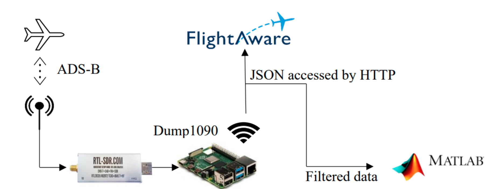

System Flow Diagram
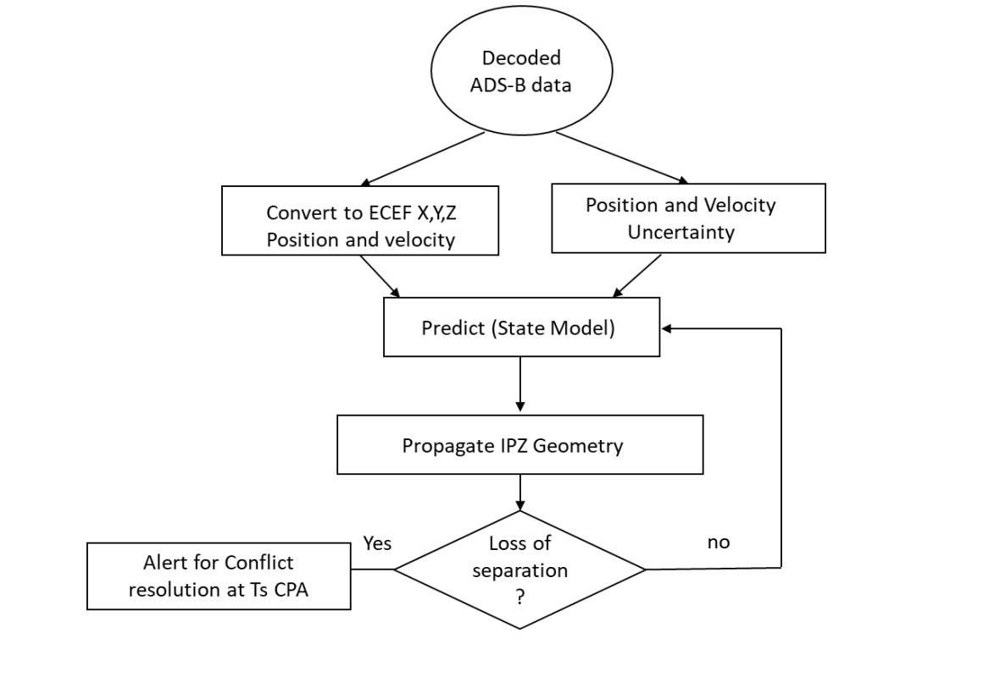

**Data pipeline:** Aircraft broadcast ADS-B OUT → decoded by Dump1090 → served as JSON → filtered to 13 fields → converted to ECEF (WGS84) → fed to IMM predictor → IPZ cylinders propagated → collision check at each timestep.

---

## Results

### ADS-B Data Capture

Real ADS-B flight data was recorded on **11/08/2021** over a **6-hour period**, capturing **279 unique flight trajectories** sampled at 1 Hz near Bristol International Airport.

**SDR signal directionality and coverage:**

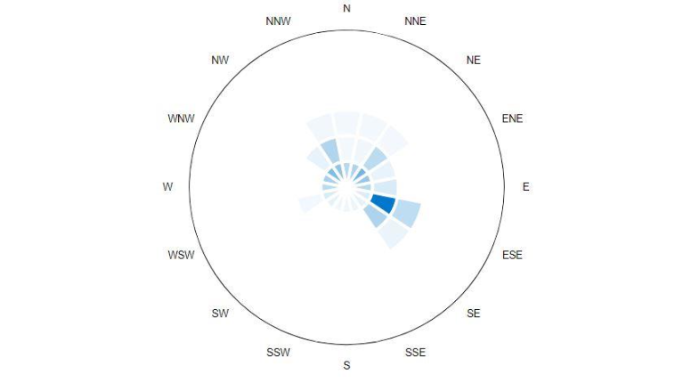
*Figure 5-1: SDR directionality strength during data capture — weakness observed south-southwest due to antenna mounting obstructions*

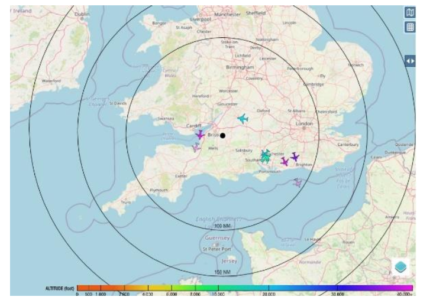
*Figure 5-2: Coverage map of incoming ADS-B information, centred at SDR receiver location*

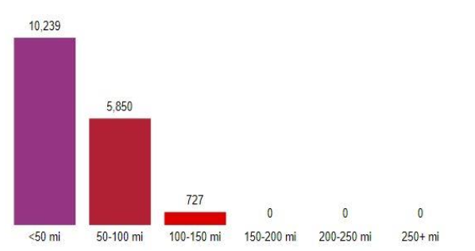
*Figure 5-3: Range of received ADS-B messages — majority within 100-mile radius, limited by antenna SNR*

---

### Trajectory Prediction

Four real flight trajectories were selected with differing dynamics to test predictor adaptability:

#### Flight DAL84 — Descent with Slight Direction Changes

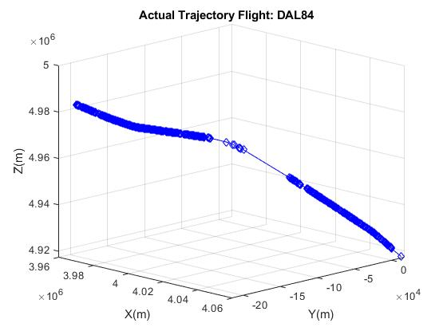
*Figure 5-4: Actual trajectory of flight DAL84*

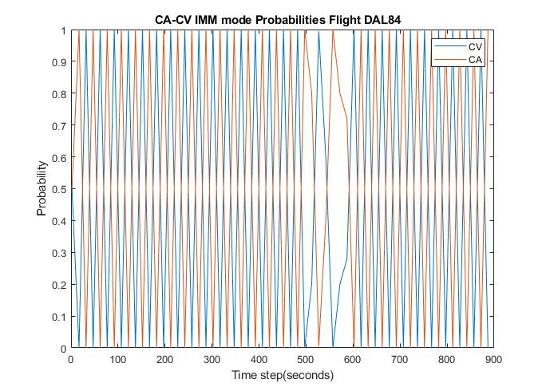
*Figure 5-5: DAL84 mode switching probabilities — IMM-CV-CA*

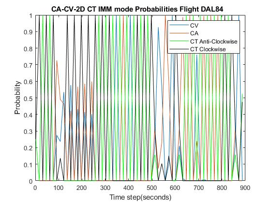
*Figure 5-6: DAL84 mode switching probabilities — IMM-CV-CA-CT2D*

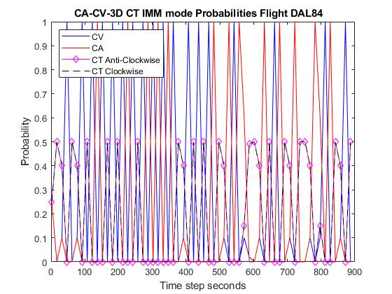
*Figure 5-7: DAL84 mode switching probabilities — IMM-CV-CA-CT3D*

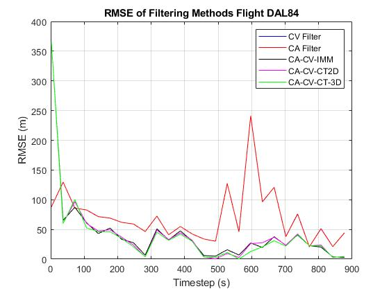
*Figure 5-8: DAL84 RMSE vs Time — all predictor methods at Ts = 15s*

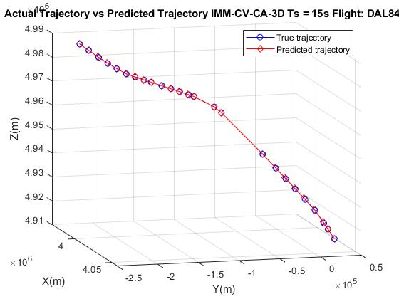
*Figure 5-9: DAL84 best trajectory prediction — IMM-CV-CA-3DCT*

---

#### Flight EXS1204 — Climb with Rapid Turn

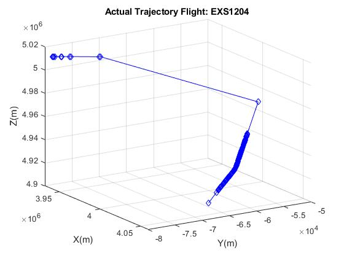
*Figure 5-12: Actual trajectory of flight EXS1204 — upward trajectory with rapid direction change*

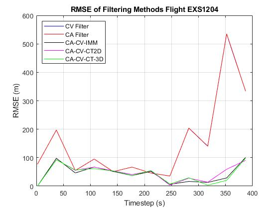
*Figure 5-16: EXS1204 RMSE vs Time — all predictor methods*

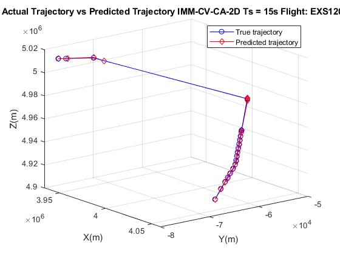
*Figure 5-17: EXS1204 best trajectory prediction — IMM-CV-CA-2DCT*

---

#### Flight EZY89TP — Landing with Clockwise/Anticlockwise Manoeuvres

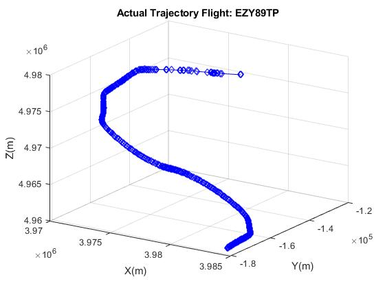  
*Figure 5-20: Actual trajectory of flight EZY89TP — landing operation with multiple turns (761 state readings)*

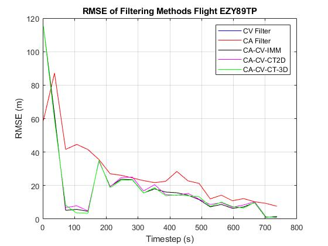
*Figure 5-24: EZY89TP RMSE vs Time — all predictor methods*

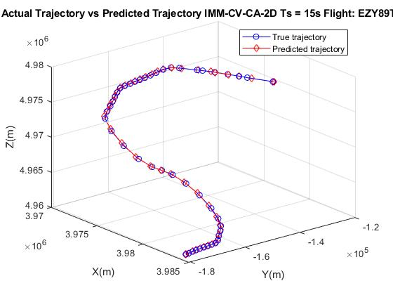
*Figure 5-25: EZY89TP best trajectory prediction — IMM-CV-CA-2DCT*

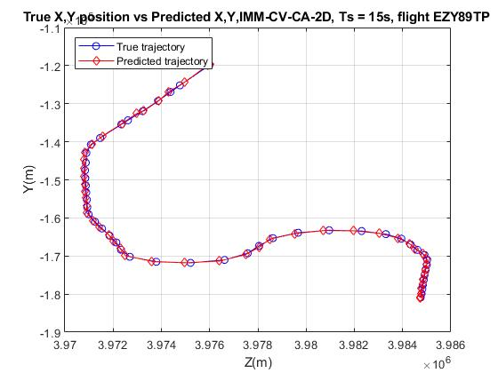
*Figure 5-26: EZY89TP IMM-CV-CA-2DCT XY position plot*

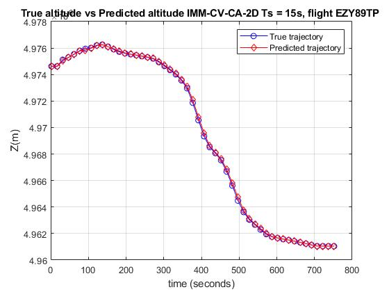
*Figure 5-27: EZY89TP IMM-CV-CA-2DCT altitude (Z) vs time*

---

#### Flight VLG84NC — Climb with Direction Change

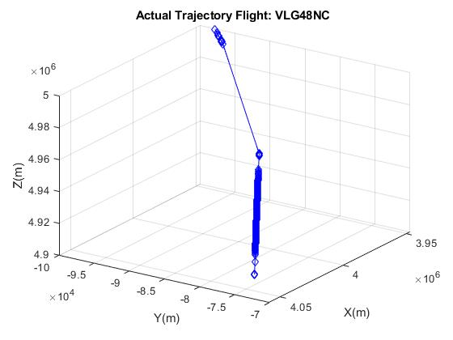
*Figure 5-28: Actual trajectory of flight VLG84NC — altitude gain with heading change (378 state readings)*

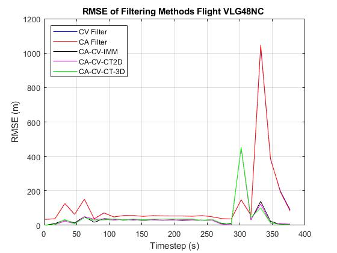
*Figure 5-32: VLG84NC RMSE vs Time — all predictor methods*

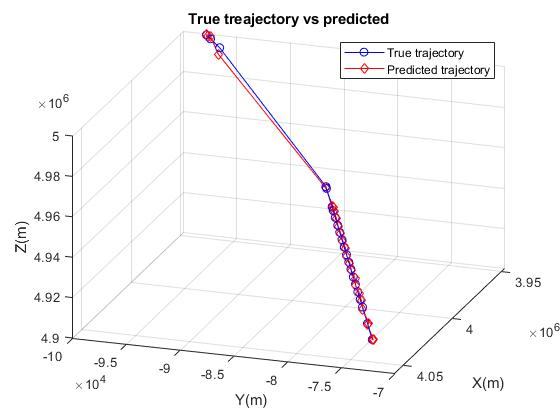
*Figure 5-33: VLG84NC best trajectory prediction — IMM-CV-CA-CT2D*

---

#### Overall RMSE Comparison

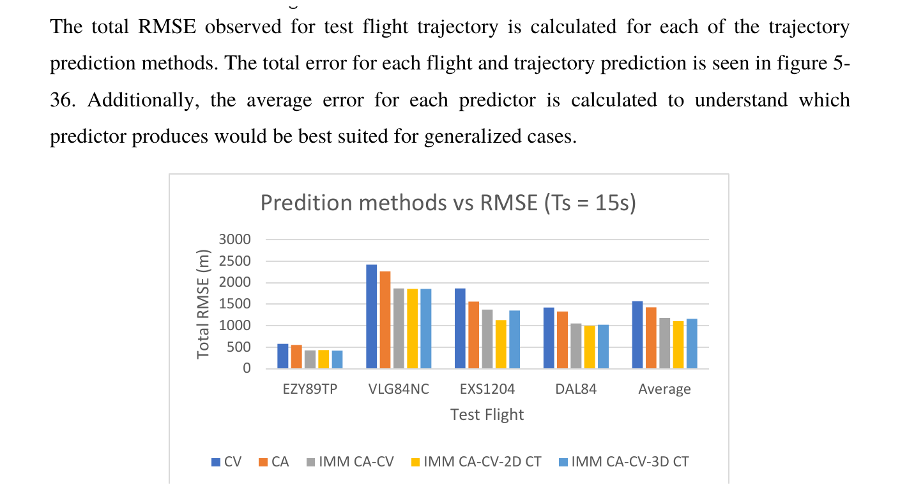
*Figure 5-36: Total RMSE of position for each test flight across all predictor methods (Ts = 15s)*

**IMM-CV-CA-CT2D achieved the best average accuracy: 21.1% more accurate than CV alone and 15.6% more accurate than CA alone.**

---

### Collision Detection

#### Static Intruder Results

Four static collision zones were placed at Trajectory Change Points (TCPs) for each test flight. The metric `T_d = T_col − T_pred` measures how early a collision was predicted (positive = ahead of actual collision).

**Flight EZY89TP:**

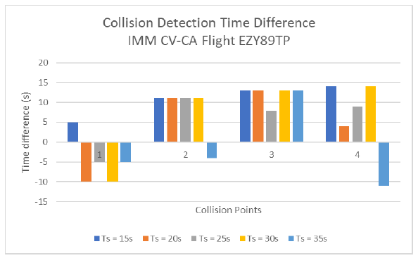
*Figure 5-37: EZY89TP collision time difference — IMM-CV-CA*

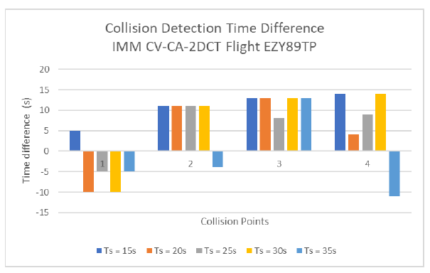
*Figure 5-38: EZY89TP collision time difference — IMM-CV-CA-2DCT*

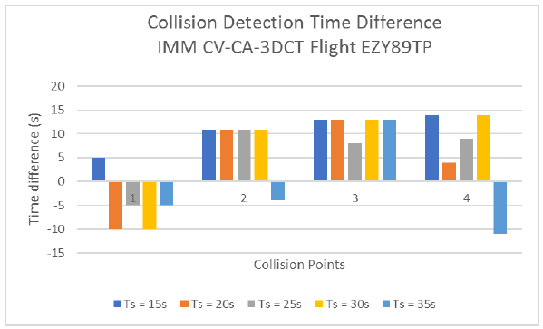
*Figure 5-39: EZY89TP collision time difference — IMM-CV-CA-3DCT*

**Flight RYR56UE:**

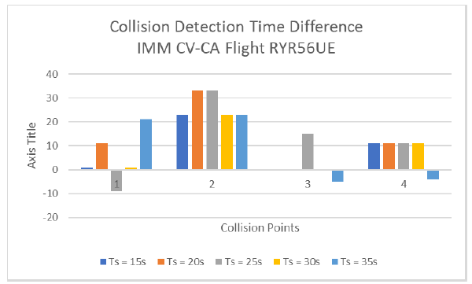
*Figure 5-40: RYR56UE collision time difference — IMM-CV-CA*

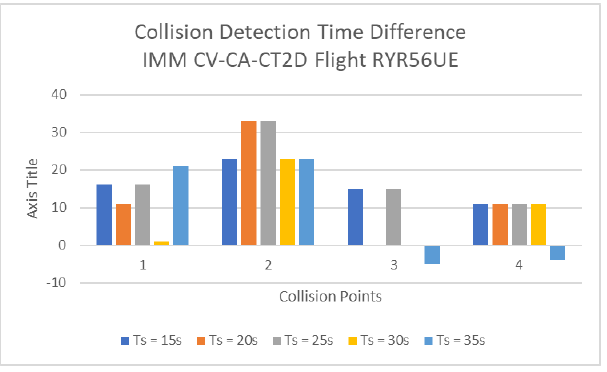
*Figure 5-41: RYR56UE collision time difference — IMM-CV-CA-2DCT*

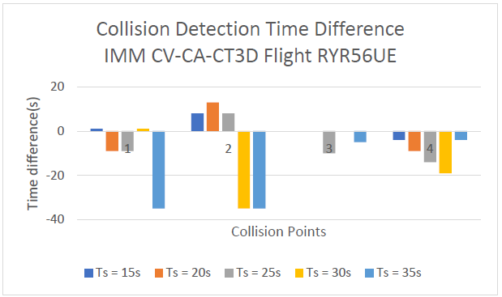
*Figure 5-42: RYR56UE collision time difference — IMM-CV-CA-3DCT*

**Flight RYR8213:**

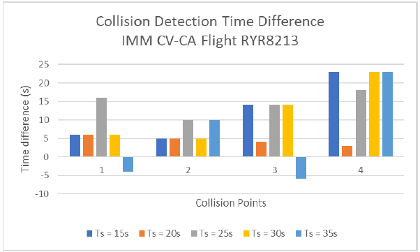
*Figure 5-43: RYR8213 collision time difference — IMM-CV-CA*

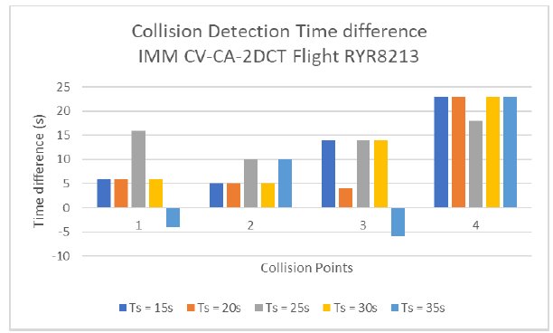
*Figure 5-44: RYR8213 collision time difference — IMM-CV-CA-2DCT*

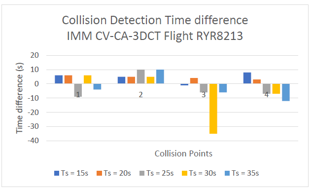
*Figure 5-45: RYR8213 collision time difference — IMM-CV-CA-3DCT*

**Flight EXS8L8:**

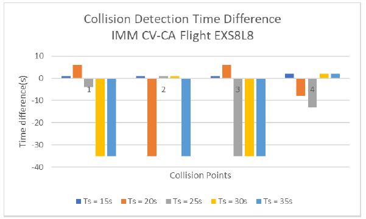
*Figure 5-46: EXS8L8 collision time difference — IMM-CV-CA*

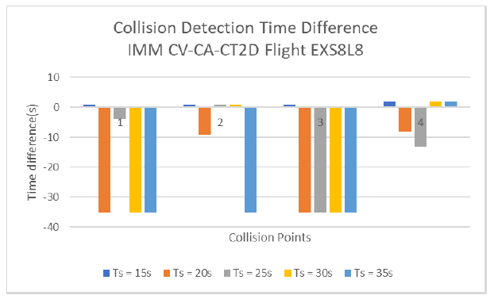
*Figure 5-47: EXS8L8 collision time difference — IMM-CV-CA-2DCT*

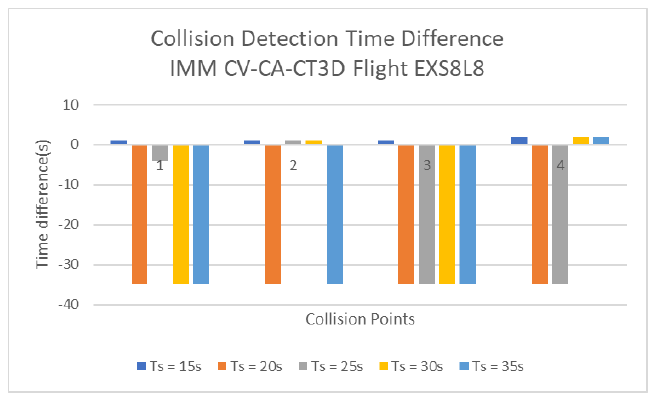
*Figure 5-48: EXS8L8 collision time difference — IMM-CV-CA-3DCT*

**Average across all static test flights:**


*Figure 5-49: Average collision time difference across all flights — IMM-CV-CA (stable 15–30 s)*


*Figure 5-50: Average collision time difference — IMM-CV-CA-2DCT (best at 15 s)*


*Figure 5-51: Average collision time difference — IMM-CV-CA-3DCT (reliable at 15 s only)*

---

#### Dynamic Intruder Results

A constant-velocity intruder was simulated on an opposing trajectory toward flight VLG8LV.


*Figure 4-13: Simulated collision with dynamic intruder — owner trajectory (blue), intruder (red)*


*Figure 5-52: Dynamic collision time difference — IMM-CV-CA*


*Figure 5-53: Dynamic collision time difference — IMM-CV-CA-2DCT (feasible to 25 s)*


*Figure 5-54: Dynamic collision time difference — IMM-CV-CA-3DCT*

---

#### Separation Volume Visualisation

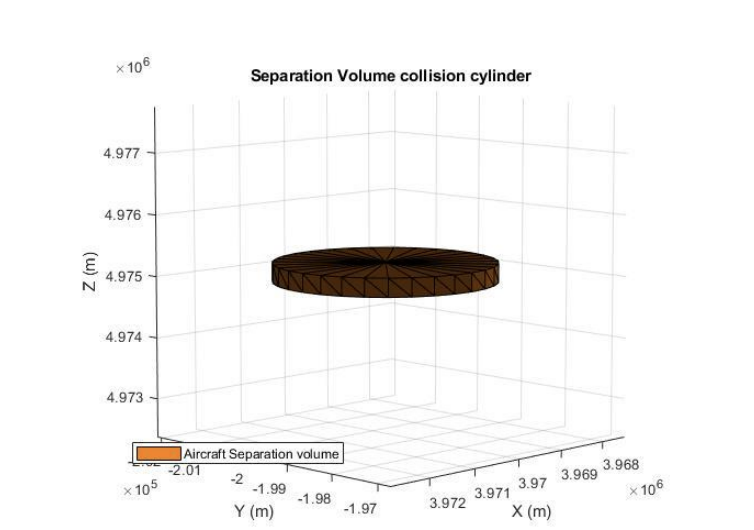
*Figure 4-5: Aircraft IPZ modelled as a collision cylinder (radius = 926 m, height = 304.8 m for owner)*

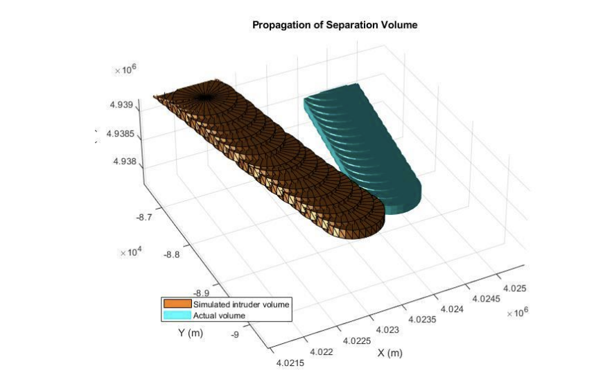
*Figure 4-6: Separation volume propagation for a dynamic intruder*

---

## Minimum Required Files

To reproduce all thesis results **from saved data (no live hardware needed)**:

### Scripts — 10 files

| File | Purpose |
|---|---|
| `single_script.m` | Main entry point — data loading, prediction, collision |
| `nomoveobsticle.m` | Static collision prediction with all IMM variants |
| `add_intruder.m` | Dynamic intruder collision simulation |
| `stationaryintru.m` | Ground-truth collision time for RYR56UE/RYR8213 |
| `stationar__intruder.m` | Ground-truth collision time for EZY89TP |
| `get_uncertainty.m` | NACp/NACv → measurement noise variances |
| `Model_Likelihood_Updt.m` | 4-mode IMM likelihood update |
| `Model_Likelihood_Updt2.m` | 2-mode IMM likelihood update |
| `Model_mix.m` | 4-mode IMM state combination |
| `Model_mix2.m` | 2-mode IMM state combination |

### Data Files — 9 files

| File | Size | Purpose |
|---|---|---|
| `DATA_Storage_08_11.mat` | ~70 MB | Full 6-hour ADS-B recording (11/08/2021) |
| `EZY89TP.mat` | ~1.2 MB | Test flight: landing with turns |
| `DAL84.mat` | ~1.2 MB | Test flight: descent |
| `EXS1204.mat` | ~1.2 MB | Test flight: climb with turn |
| `VLG84NC.mat` | ~1.2 MB | Test flight: climb with direction change |
| `VLG8LV.mat` | ~1.2 MB | Dynamic collision owner flight |
| `RYR56UE.mat` | ~1.2 MB | Static collision test flight |
| `RYR8213.mat` | ~1.2 MB | Static collision test flight |
| `EXS8LB.mat` | ~1.2 MB | Static collision test flight |

> **Note:** `DATA_Storage_08_11.mat` can be replaced with pre-built `flight_table.mat` if individual flights have already been extracted and saved.

---

## Quick Start

### Prerequisites

- MATLAB R2020a or later
- Robotics System Toolbox (`collisionCylinder`, `checkCollision`)
- Mapping Toolbox (`lla2ecef`)

### Setup

```matlab
% 1. Clone the repo and open MATLAB
% 2. Set working directory to repo root
cd('UAV-Trajectory-Prediction')

% 3. Add helper functions to path
addpath('helper_functions')
savepath
```

### Run Trajectory Prediction

```matlab
% Open and run the main script
% At prompts, select:
%   Data source       → 0 (Saved Data)
%   Kalman testing    → 1 (skip rebuild)
%   Prediction model  → 3 (IMM CV-CA-CT, best overall)
%   Ts                → 15
%   Collision sim     → 0 (prediction only)

run('scripts/single_script.m')
```

### Run Static Collision Detection

```matlab
% Edit load line in nomoveobsticle.m to select flight, then:
% At prompts:
%   Ts           → 15
%   Model        → 2 (IMM CV-CA-CT2D)

run('scripts/nomoveobsticle.m')
```

### Run Dynamic Collision Simulation

```matlab
% Requires VLG8LV.mat in working directory
run('scripts/add_intruder.m')
```

---

## Repository Structure

```
UAV-Trajectory-Prediction/
│
├── scripts/
│   ├── single_script.m          ← MAIN entry point
│   ├── nomoveobsticle.m         ← Static collision prediction
│   ├── add_intruder.m           ← Dynamic intruder simulation
│   ├── resultstest.m            ← Flight data extraction
│   ├── IMM_mod_2D.m             ← Standalone IMM-CV-CA-CT2D
│   ├── IMM2.m                   ← Standalone IMM-CV-CA (dev)
│   ├── stationaryintru.m        ← Ground-truth T_col
│   ├── stationar__intruder.m    ← Ground-truth T_col (EZY89TP)
│   ├── RMSEplotCV.m             ← Multi-filter RMSE comparison
│   └── ...                      ← Other dev/utility scripts
│
├── helper_functions/
│   ├── get_uncertainty.m        ← NACp/NACv → variance values
│   ├── Model_Likelihood_Updt.m  ← 4-mode IMM likelihood
│   ├── Model_Likelihood_Updt2.m ← 2-mode IMM likelihood
│   ├── Model_Likelihood_Updt3.m ← 3-mode IMM likelihood
│   ├── Model_mix.m              ← 4-mode state combination
│   ├── Model_mix2.m             ← 2-mode state combination
│   └── Model_mix3.m             ← 3-mode state combination
│
├── data/
│   ├── raw/
│   │   └── DATA_Storage_08_11.mat   ← Primary 6-hour dataset
│   ├── flight_objects/
│   │   ├── EZY89TP.mat
│   │   ├── DAL84.mat
│   │   ├── EXS1204.mat
│   │   ├── VLG84NC.mat
│   │   ├── VLG8LV.mat
│   │   ├── RYR56UE.mat
│   │   ├── RYR8213.mat
│   │   └── EXS8LB.mat
│   └── intermediate/
│       ├── flight_table.mat
│       ├── filtered_data.mat
│       └── For_linear_filter.mat
|
├── plotting/                    ← Plotting Functions 
│
├── images/                      ← Thesis figures
│
├── UAV Trajectory Prediction for Collision Avoidance-signed.pdf 
└── README.md
```

---

## Dependencies

### MATLAB Toolboxes

| Toolbox | Functions Used | Required |
|---|---|---|
| Robotics System Toolbox | `collisionCylinder`, `trvec2tform`, `checkCollision` | **Yes** |
| Mapping Toolbox | `lla2ecef` | **Yes** |
| Aerospace Toolbox | `ecef2lla` (inverse conversion) | Optional |

### Hardware (live data only — not needed for saved data)

| Component | Specification |
|---|---|
| RTL-SDR Receiver | R820T2 / RTL2832U, 500 kHz–1766 MHz |
| Antenna | Half-wave dipole, 137.6 mm effective length |
| Raspberry Pi | Model 4B, 4 GB RAM |
| Software (Pi) | Dump1090-fa + PiAware |

---

## Key Parameters

| Parameter | Variable | Default | Notes |
|---|---|---|---|
| Prediction timestep | `Ts` | `15` s | 15–25 s recommended |
| CV process noise | `Velnoise` | `40` (m/s²)² | Increase for more manoeuvrability |
| CA process noise | `acc_noise` | `100` (m/s³)² | |
| CT2D turn rate (CW) | `w2` | `-2` deg/s | Values >5 cause overshooting |
| CT2D turn rate (CCW) | `w1` | `+2` deg/s | |
| CT3D turn rate | `w1/w2` | `±1.5` deg/s | |
| Owner IPZ radius | — | `926 m` (1 NM) | Augmented for owner aircraft |
| Owner IPZ height | — | `304.8 m` (1000 ft) | |
| Intruder IPZ radius | — | `463 m` (0.5 NM) | Per Eurocontrol RPAS spec RPA11 |
| Intruder IPZ height | — | `152.4 m` (500 ft) | |

---

## Citation

```bibtex
@mastersthesis{ramjee2021uav,
  author    = {Mayur Ramjee},
  title     = {UAV Trajectory Prediction for Collision Avoidance},
  school    = {University of Bath},
  year      = {2021},
  month     = {September},
  type      = {MSc Dissertation},
  department= {Department of Electronic \& Electrical Engineering},
  keywords  = {ADS-B, IMM, UAV, Sense and Avoid, Collision Avoidance}
}
```

---

## Acknowledgements

Supervised by **Dr Rob Wortham**, University of Bath.  
Funded by the **Chevening Scholarship**, FCDO South Africa.

---

*For full algorithm derivations, experimental methodology, and detailed results, see the dissertation PDF included in this repository.*
